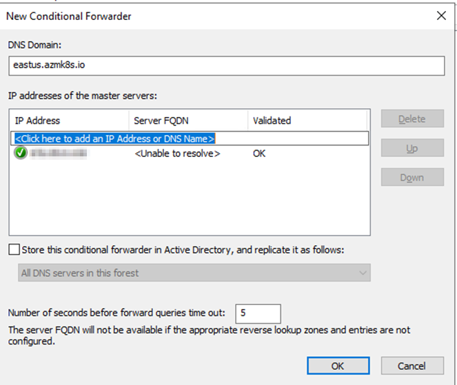

*Securing Kubernetes workloads by removing public endpoints and utilizing internal load balancers.*

| Date | Category |
|------|----------|
| 2025-12-01 | Azure / Kubernetes |

---

## Overview
- **What:** We will deploy a fully private Azure Kubernetes Service (AKS) cluster that is only accessible from within our Virtual Network (VNet).
- **Why:** To achieve a **Zero Trust** architecture where the API server and workloads have **zero public visibility**. This ensures that no part of the cluster is reachable from the public internet, reducing the attack surface to the absolute minimum.
- **Who:** Cloud Engineers and DevOps professionals looking to secure their container infrastructure.

---

## Prerequisites
- **Azure CLI** installed locally.
- **Resource Group** created for the AKS Cluster.
- **Virtual Network (VNet)** with a dedicated `/24` subnet available for AKS.
- **Firewall rule from on-premises to AKS subnet**
- **Route Table (UDR)** associated with the AKS subnet containing a `0.0.0.0/0` route (required for `--outbound-type userDefinedRouting`).
- **Hub & Spoke / Hybrid Connectivity:** Ensure you have network line-of-sight to the VNet. This could be via:
  - **Site-to-Site (S2S) VPN** or **ExpressRoute** (for on-prem hybrid access).
  - **Point-to-Site (P2S) VPN** (for individual developer access).
  - A **Jumpbox VM** inside the VNet.

---

### Firewall Requirements (Egress)
For a private AKS cluster to function (pull system images, register nodes), your Azure Firewall **must** allow outbound HTTPS (443) access to these Global Microsoft FQDNs:

| FQDN | Purpose |
|------|---------|
| `mcr.microsoft.com` | **Required.** Access to Microsoft Container Registry (CoreDNS, etc). |
| `*.data.mcr.microsoft.com` | **Required.** Backing storage for MCR images. |
| `management.azure.com` | Kubernetes operations against Azure API. |
| `login.microsoftonline.com` | Microsoft Entra ID authentication. |
| `packages.microsoft.com` | Cached apt-get operations (Moby, Azure CLI). |
| `acs-mirror.azureedge.net` | Required binaries (kubenet, Azure CNI). |
| `packages.aks.azure.com` | Future replacement for acs-mirror. |

> **⚠️ Critical:** If these are blocked, your nodes will fail to register and the cluster creation will hang/fail.

---

## Implementation Steps

[📥 **View all commands used in this guide**](./all-commands.sh)

### 1. Deploy the Private AKS Cluster
We use the Azure CLI to create the cluster. The key flags here are `--enable-private-cluster` and `--disable-public-fqdn` to ensure no public access is allowed. We also specify `--outbound-type userDefinedRouting` to control egress traffic.

[📄 **View the full creation script**](./create-cluster.sh)

```bash
az aks create \
    --name <private-cluster-name> \
    --resource-group <resource-group-name> \
    --vnet-subnet-id <subnet-resource-id> \
    --enable-private-cluster \
    --network-plugin azure \
    --enable-managed-identity \
    --node-count <node-count> \
    --node-vm-size <sku> \
    --location <region> \
    --outbound-type userDefinedRouting \
    --disable-public-fqdn
```

> **⚠️ Critical Requirement for `userDefinedRouting`:**
> Since we are using `--outbound-type userDefinedRouting`, you **must** have a Route Table associated with your AKS subnet *before* running this command. This route table should typically have a `0.0.0.0/0` route pointing to your Firewall or NVA (Network Virtual Appliance).
>
> *   **Why?** This tells Azure: "Don't give my cluster a Public IP. I will handle the routing myself (usually to my Firewall)."
> *   **Beginner Tip:** If you are just testing in a lab and don't have a Firewall set up, remove this flag. Azure will default to `loadBalancer` and give you a Public IP for egress, which is easier for learning but less secure.

*Note: Once completed, Azure will create a secondary resource group (usually starting with `MC_`) to house the node pools, load balancers, and other infrastructure.*


### 2. Accessing the Cluster (Without VPN)
If you are not currently connected to the VNet (via VPN or Jumpbox), you can still manage the cluster using the `command invoke` feature.

```bash
# Run kubectl commands directly via the Azure API
az aks command invoke \
  --resource-group <resource-group-name> \
  --name <cluster-name> \
  --command "kubectl get pods -n kube-system"
```

**Common commands to try:**
* `kubectl get nodes`
* `kubectl describe pod <pod-name>`
* `kubectl apply -f <file-name>`

### 3. Deploying an Internal Load Balancer
To restrict access to your applications so they are only reachable from within the VNet (or peered networks), you must use an **Internal Load Balancer**.

In Kubernetes, you don't create the Load Balancer manually in the Azure Portal. Instead, you define a `Service` manifest with a specific annotation, and AKS automatically provisions the Azure Load Balancer resource for you in the node resource group.

[📄 **View the Service Manifest**](./internal-lb.yaml)

**Create a YAML manifest (`internal-lb.yaml`):**
```yaml
apiVersion: v1
kind: Service # Deploying Internal Load Balancer as a svc
metadata:  
  name: internal-lb  #name for our internal load balancer
  annotations:
    service.beta.kubernetes.io/azure-load-balancer-internal: "true"  # THIS IS NEEDED
spec:
  type: LoadBalancer
  loadBalancerIP: <IP Address>  # Choose an unused IP from your subnet
  ports:
  - port: 80  #Adjust as needed
    targetPort: 80  #Adjust as needed
    protocol: TCP  #Adjust as needed
  selector:
    app: my-app
```

**Apply the manifest:**
```bash
kubectl apply -f internal-lb.yaml
```

**Verify the Service:**
```bash
kubectl get service internal-lb
```

**Expected Output:**
```text
NAME           TYPE           CLUSTER-IP    EXTERNAL-IP   PORT(S)        AGE
internal-lb   LoadBalancer   10.0.248.59   10.240.0.7    80:30555/TCP   2m
```
> **Note:** The `EXTERNAL-IP` column shows `10.240.0.7`. In this context, "External" refers to the load balancer's interface *outside* the pod network, but it is still a **private IP** from your VNet subnet. It is **not** a public internet IP.

> **⚠️ Developer Note:**
> Every time you deploy a new application (Deployment/Pod), you **MUST** pair it with a Service manifest containing the `service.beta.kubernetes.io/azure-load-balancer-internal: "true"` annotation. If you forget this annotation and just use `type: LoadBalancer`, Azure will attempt to provision a **Public IP**, which violates our private cluster design.

**Verify the IP:**
```bash
kubectl get svc
```

### 4. Login via CLI (With Network Access)
If you are on the VPN or a jumpbox, you can use the standard `kubectl` workflow.

```bash
az login
az account set --subscription <subscription-id>
kubelogin convert-kubeconfig -l azurecli
kubectl get nodes
```

### 5. DNS & Naming Resolution (The Critical Part)
When building a private AKS cluster, you are dealing with **two separate** Private DNS requirements. It is crucial not to confuse them.

#### A. The Cluster API Server (Control Plane)
When you deployed the cluster with `--enable-private-cluster`, Azure **automatically** created:
1.  A **Private Endpoint** for your API Server.
2.  A **Private DNS Zone** (usually named like `privatelink.<region>.azmk8s.io`) in the node resource group.

*   **Why strict DNS is required:** To ensure the security of the control plane. Since the API server has **no public IP**, it can *only* be reached via its Private Endpoint IP. The Private DNS Zone maps the cluster name to this private IP, ensuring that all API traffic stays within the Azure backbone.
*   **The Result:** `kubectl` commands will only start working once this DNS resolution path is established.
*   **Hybrid Access (Crucial):** If you need to manage the cluster from On-Premises, you **must** create a Conditional Forwarder on your local DNS server.
    *   **The Rule:** Point `<region>.azmk8s.io` to your Azure DNS Resolver IP.
    *   **Example:** As shown below, for our East US cluster, we forward `eastus.azmk8s.io`.



#### B. Your Internal Applications (Data Plane)
This is what we are configuring here. Your actual apps (running on the Internal Load Balancer) need their own custom domain name (e.g., `app.internal.corp`) so valid certificates can be issued and users can remember the address.

**1. Create a Custom Private DNS Zone:**
```bash
az network private-dns zone create -g <resource-group> -n customdomain.internal
```

**2. Link to VNet:**
We must link this new zone to the VNet so the cluster nodes (and you) can resolve it.
```bash
az network private-dns link vnet create \
  -g <resource-group> -n MyDNSLink \
  -z customdomain.internal -v <vnet-resource-id> -e false
```

**3. Create A Record:**
Map your custom name to the Internal Load Balancer IP you got from `kubectl get svc`.
```bash
az network private-dns record-set a add-record \
  -g <resource-group> -z customdomain.internal \
  -n app -a <ILB-Private-IP>
```

**4. Hybrid Connectivity (On-Premises):**
Now, any machine on the VNet can resolve our custom domain. But for **On-Premises** users to reach it:
*   You must have a DNS Forwarder / Resolver in Azure (or use Azure Firewall DNS Proxy).
*   You must create a **Conditional Forwarder** on your local Windows DNS Server pointing `customdomain.internal` to the Outbound Endpoint of our Azure Private DNS Resolver.


---

## Troubleshooting & Verification

[📄 **View the full Kubectl & Debugging Cheat Sheet**](./kubectl-commands.sh)

Since this is a private cluster, debugging connectivity or pod failures can be tricky if your VPN is down. Here is how to verify the health of your cluster using two different methods.

### Method 1: Standard Kubectl (Requires VPN/Jumpbox)
If you are connected to the network, use these standard commands to check the pulse of your cluster:

*   **Check Node Status:** Ensure all nodes are `Ready`.
    ```bash
    kubectl get nodes
    ```
*   **Check Pod Health:** 
    ```bash
    kubectl get pods
    ```
*   **Debug a Service:** 
    ```bash
    kubectl describe svc internal-lb
    ```

### Method 2: Emergency Access (No VPN)
If you cannot reach the private API server, use `az aks command invoke` to run the same checks via the Azure API.

*   **Check Nodes:**
    ```bash
    az aks command invoke -g <rg> -n <cluster> -c "kubectl get nodes"
    ```
*   **Check Pod Logs (Critical for debugging):**
    ```bash
    az aks command invoke -g <rg> -n <cluster> -c "kubectl logs <pod-name>"
    ```
*   **Describe a Pod (Why is it failing?):**
    ```bash
    az aks command invoke -g <rg> -n <cluster> -c "kubectl describe pod <pod-name>"
    ```

---

## Common Issues & Solutions
- **Issue:** A Public IP is created for my service instead of a private one.
  - **Solution:** You likely missed the annotation in your YAML file. Ensure `service.beta.kubernetes.io/azure-load-balancer-internal: "true"` is present in the `metadata` section of your Service definition.

- **Issue:** Cannot resolve the AKS API server address.
  - **Solution:** For private clusters, you must link the Private DNS Zone to your VNet so your machine can resolve the private hostname.

---

## Key Takeaways
- **Private by Default:** Using `--enable-private-cluster` and `--disable-public-fqdn` ensures your control plane is isolated.
- **Internal Exposure:** By using the internal load balancer annotation, we ensure that the application is **only** assigned a private IP from the subnet. No Public IP resource is ever created, guaranteeing the service remains invisible to the outside world.
- **Emergency Access:** Use `az aks command invoke` to troubleshoot the cluster if your VPN connectivity is down.

---

## Resources & Documentation
- [Create a private AKS cluster](https://learn.microsoft.com/en-us/azure/aks/private-clusters)
- [Use an internal load balancer with AKS](https://learn.microsoft.com/en-us/azure/aks/internal-lb)
