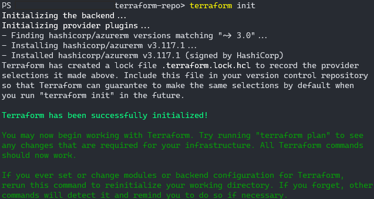
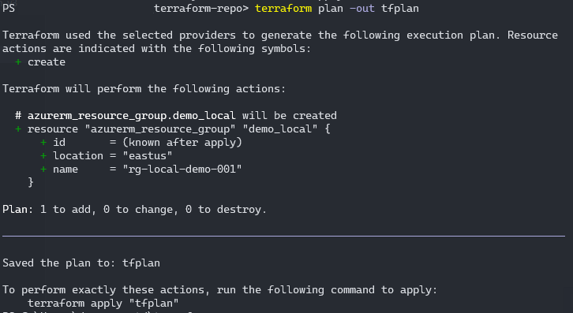
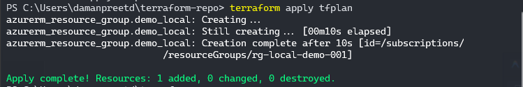
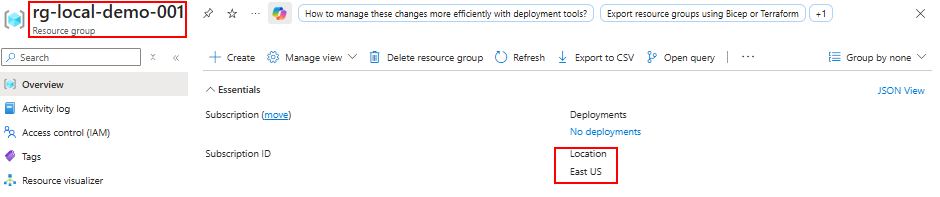
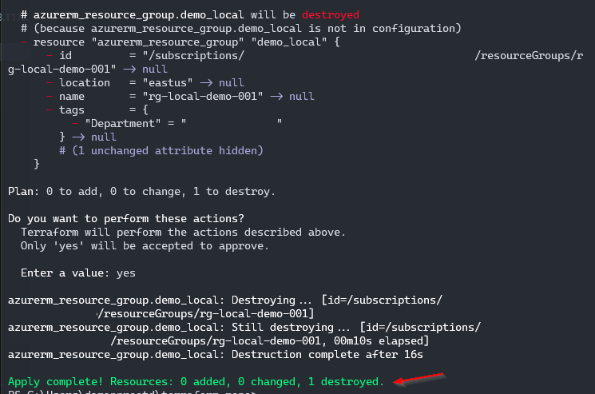

*Learn the fundamentals of Terraform by running it locally with Azure CLI authentication.*

| Info               | Details                      |
| ------------------ | ---------------------------- |
| **Series**         | [ClickOps to Terraform](../) |
| **Part**           | 1 of 5                       |
| **Difficulty**     | Beginner to Intermediate     |
| **Estimated Time** | 1 Hour                       |

---

## Welcome to the ClickOps to Terraform Series

If you've been managing Azure resources through the portal—clicking, configuring, and hoping you remember what you did last time—you're not alone. Most of us started that way. But as your infrastructure grows, so does the pain of "ClickOps."

This **5-part series** is your guide to transitioning from manual portal work to automated, repeatable, and version-controlled infrastructure with Terraform. By the end, you'll confidently write Terraform code, automate deployments through Azure DevOps, and even bring your existing Azure resources under Terraform management.

### Series Roadmap

| Part | Title | What You'll Learn |
|------|-------|-------------------|
| **1** | **Terraform with Azure CLI** *(You are here)* | Local development, HCL basics, the Terraform workflow |
| **2** | Setting Up Azure DevOps & Terraform | Service principals, remote state, your first pipeline |
| **3** | Getting Comfortable with Terraform | Variables, outputs, remote state, building confidence |
| **4** | Importing Existing Resources | Using `terraform import` to bring in existing Azure resources |
| **5** | Adopting Terraform as an Organization | Team workflows, standards, moving away from ClickOps for good |

Each part builds on the previous, but they're designed to be practical enough to reference individually when you need them.

> 📅 **Release Schedule:** Part 1 is available now. New parts will be released weekly—check back soon for Part 2!

---

## Why Learn Terraform? (Even If It Seems Intimidating)

Terraform and Infrastructure as Code might feel overwhelming if you're used to the Azure Portal. The syntax looks foreign, state files seem scary, and pipelines add complexity. **That's completely normal.**

But here's the truth: **Terraform is worth the learning curve.** Here's why:

| ClickOps Reality | Terraform Reality |
|------------------|-------------------|
| "How did we configure that NSG rule in prod?" | `git log network.tf` — full history |
| Recreating dev environment takes 4+ hours of clicking | `terraform apply -var="env=dev"` — 15 minutes |
| New team member spends 3 days setting up their environment | `git clone && terraform apply` — 10 minutes |
| Someone accidentally deletes a resource | Terraform detects drift and can recreate it |
| Auditor asks for proof of compliance | Show them the code — every setting is documented |

**The investment:** ~15 hours to learn the fundamentals.  
**The payoff:** You'll save that time back after recreating environments just a few times.

If you're comfortable with Azure CLI or PowerShell, you can learn Terraform. The syntax is simple, the workflow is predictable, and once it clicks, you'll wonder why you ever did it the old way.

---

## Overview

In this first part, we'll run Terraform directly on your local machine. No pipelines, no service principals, no complexity—just you, your terminal, and Azure. This is the best way to learn because you can see exactly what's happening at each step.

By the end of this guide, you'll have deployed real Azure resources using Terraform and understand the core workflow that everything else builds upon.

### What You'll Learn
- Installing and configuring Terraform
- The Terraform workflow: `init`, `plan`, `apply`, `destroy`
- How Terraform authentication works locally
- Understanding HCL (HashiCorp Configuration Language) syntax
- Professional file structure and organization
- Best practices for local development

---

## Prerequisites

- **Azure Subscription** with Contributor access
- **Azure CLI** installed ([Download here](https://docs.microsoft.com/en-us/cli/azure/install-azure-cli))
- **Code Editor** (VS Code recommended)
- **Terminal/Command Line** access

---

## 1. Installing Terraform

Let's get Terraform installed on your machine. Choose your operating system below:

### Windows (Chocolatey - Recommended)

```powershell
# Run in Administrator PowerShell
choco install terraform -y
```

### macOS (Homebrew)

```bash
brew tap hashicorp/tap
brew install hashicorp/tap/terraform
```

### Linux (Ubuntu/Debian)

```bash
wget -O- https://apt.releases.hashicorp.com/gpg | sudo gpg --dearmor -o /usr/share/keyrings/hashicorp-archive-keyring.gpg
echo "deb [signed-by=/usr/share/keyrings/hashicorp-archive-keyring.gpg] https://apt.releases.hashicorp.com $(lsb_release -cs) main" | sudo tee /etc/apt/sources.list.d/hashicorp.list
sudo apt update && sudo apt install terraform
```

### Verify Installation

```bash
terraform version
```

**Expected Output:**
```
Terraform v1.6.x
on darwin_arm64
```

### Install VS Code Extension

1. Open VS Code
2. Go to Extensions (Cmd/Ctrl + Shift + X)
3. Search for "HashiCorp Terraform"
4. Install the official extension

---

## 2. The Terraform Workflow

Before writing any code, let's understand the core commands you'll use every time. Terraform follows a predictable workflow:

```
┌─────────────┐     ┌─────────────┐     ┌─────────────┐     ┌─────────────┐
│             │     │             │     │             │     │             │
│    init     │ ──▶ │    plan     │ ──▶ │    apply    │ ──▶ │   destroy   │
│             │     │             │     │             │     │             │
│ Download    │     │ Preview     │     │ Execute     │     │ Tear down   │
│ providers   │     │ changes     │     │ changes     │     │ resources   │
└─────────────┘     └─────────────┘     └─────────────┘     └─────────────┘
```

| Command | What It Does | When to Use |
|---------|--------------|-------------|
| `terraform init` | Downloads provider plugins, initializes backend | First time setup, or after adding providers |
| `terraform plan` | Shows what Terraform *will* do without doing it | Always run before apply |
| `terraform apply` | Creates/updates resources in Azure | When you're ready to deploy |
| `terraform destroy` | Deletes all resources managed by this config | Cleanup or tear down |

**The golden rule:** Always run `plan` before `apply`. Never apply blind.

---

## 3. Understanding Terraform Authentication

Now that you know the workflow, let's understand **who** Terraform acts as when it talks to Azure.

When running locally, Terraform uses your existing Azure CLI credentials.

### Local Authentication Flow

When you run `terraform apply` on your laptop:

1. Terraform looks for Azure credentials in your environment
2. It finds the authentication token from `az login`
3. **Result:** Terraform acts **as YOU**

```
┌──────────────┐         ┌──────────────┐         ┌──────────────┐
│              │         │              │         │              │
│  You run     │  ────▶  │  Terraform   │  ────▶  │  Azure API   │
│  terraform   │         │  uses your   │         │  creates     │
│  apply       │         │  az login    │         │  resources   │
│              │         │  token       │         │              │
└──────────────┘         └──────────────┘         └──────────────┘
```

**Key Point:** If you have permission to create a Resource Group, Terraform has permission. If you don't, Terraform doesn't.

> 💡 **In Part 2**, we'll cover how authentication works differently in CI/CD pipelines using service principals.

---

## 4. Understanding HCL Syntax

Terraform uses HCL (HashiCorp Configuration Language). It might look intimidating, but it follows a simple pattern:

### The Basic Pattern

```hcl
BLOCK_TYPE "PROVIDER_TYPE" "INTERNAL_NAME" {
  argument = value
  argument = value
}
```

### Real Example

```hcl
# BLOCK TYPE  "PROVIDER TYPE"           "INTERNAL NAME"
resource      "azurerm_resource_group"  "demo" {
  
  # ARGUMENTS
  name     = "rg-local-demo-001"
  location = "East US"
}
```

**Breaking it down:**
- **Block Type (`resource`)**: Tells Terraform "I want to CREATE something"
- **Provider Type (`azurerm_resource_group`)**: The specific Azure resource type
- **Internal Name (`demo`)**: A nickname for this resource in your code (Azure never sees this)
- **Arguments**: Configuration values (name, location, etc.)

### Referencing Resources

You can reference other resources using the pattern: `BLOCK_TYPE.INTERNAL_NAME.ATTRIBUTE`

```hcl
# Create a resource group
resource "azurerm_resource_group" "demo" {
  name     = "rg-demo-001"
  location = "East US"
}

# Create a VNet in that resource group
resource "azurerm_virtual_network" "demo_vnet" {
  name                = "vnet-demo-001"
  location            = azurerm_resource_group.demo.location  # Reference!
  resource_group_name = azurerm_resource_group.demo.name      # Reference!
  address_space       = ["10.0.0.0/16"]
}
```

---

## 5. Your First Terraform Deployment

### Step 1: Create a Project Folder

```bash
mkdir ~/terraform-learning
cd ~/terraform-learning
```

### Step 2: Authenticate to Azure

```bash
az login
az account set --subscription "YOUR-SUBSCRIPTION-NAME"
```

### Step 3: Create `main.tf`

Create a file named `main.tf` with this content:

```hcl
# Configure Terraform to use the Azure provider
terraform {
  required_providers {
    azurerm = {
      source  = "hashicorp/azurerm"
      version = "~> 3.0"
    }
  }
}

# Configure the Azure provider
provider "azurerm" {
  features {}
}

# Create a resource group
resource "azurerm_resource_group" "demo_local" {
  name     = "rg-terraform-local-demo"
  location = "East US"
}
```

### Step 4: Run the Terraform Workflow

#### Initialize (Download Provider Plugins)

```bash
terraform init
```

**What happens:**
- Terraform reads your `terraform {}` block
- Downloads the Azure provider plugin
- Creates a `.terraform` folder (don't commit this to Git!)



#### Plan (Preview Changes)

```bash
terraform plan
```

**What happens:**
- Terraform compares your code to what exists in Azure
- Shows you what it will create, update, or destroy
- No changes are made yet!

**Expected Output:**
```
Terraform will perform the following actions:

  # azurerm_resource_group.demo_local will be created
  + resource "azurerm_resource_group" "demo_local" {
      + id       = (known after apply)
      + location = "eastus"
      + name     = "rg-terraform-local-demo"
    }

Plan: 1 to add, 0 to change, 0 to destroy.
```



#### Apply (Execute Changes)

```bash
terraform apply
```

**What happens:**
- Shows you the plan again
- Asks for confirmation (type `yes`)
- Creates the resources in Azure
- Saves the state to `terraform.tfstate`

**🎉 Success!** Check the Azure Portal - you should see your new resource group!





#### Destroy (Clean Up)

```bash
terraform destroy
```

**What happens:**
- Shows what will be deleted
- Asks for confirmation (type `yes`)
- Removes all resources managed by this Terraform code



---

## 6. Professional File Structure

Running everything in a single `main.tf` works for learning, but in production, we split our code into multiple files for better organization.

**Important:** Terraform loads **ALL** `.tf` files in a folder together. Splitting files is purely for human readability.

### The Standard Pattern

```
terraform-project/
├── providers.tf      # Terraform and provider configuration
├── variables.tf      # Input variables
├── main.tf          # Resource definitions
├── outputs.tf       # Output values
└── .gitignore       # Ignore terraform state files
```

### Example: Multi-File Structure

#### `providers.tf`
```hcl
terraform {
  required_version = ">= 1.0"
  
  required_providers {
    azurerm = {
      source  = "hashicorp/azurerm"
      version = "~> 3.0"
    }
  }
}

provider "azurerm" {
  features {}
}
```

#### `variables.tf`
```hcl
variable "location" {
  description = "Azure region for resources"
  type        = string
  default     = "East US"
}

variable "environment" {
  description = "Environment name (dev, staging, prod)"
  type        = string
  default     = "dev"
}

variable "project_name" {
  description = "Project name for resource naming"
  type        = string
  default     = "demo"
}
```

#### `main.tf`
```hcl
# Resource Group
resource "azurerm_resource_group" "main" {
  name     = "rg-${var.project_name}-${var.environment}"
  location = var.location
  
  tags = {
    Environment = var.environment
    ManagedBy   = "Terraform"
  }
}

# Virtual Network
resource "azurerm_virtual_network" "main" {
  name                = "vnet-${var.project_name}-${var.environment}"
  location            = azurerm_resource_group.main.location
  resource_group_name = azurerm_resource_group.main.name
  address_space       = ["10.0.0.0/16"]
  
  tags = {
    Environment = var.environment
    ManagedBy   = "Terraform"
  }
}
```

#### `outputs.tf`
```hcl
output "resource_group_name" {
  description = "Name of the created resource group"
  value       = azurerm_resource_group.main.name
}

output "vnet_id" {
  description = "ID of the created virtual network"
  value       = azurerm_virtual_network.main.id
}
```

#### `.gitignore`
```
# Terraform files
.terraform/
*.tfstate
*.tfstate.*
.terraform.lock.hcl

# Crash logs
crash.log

# Variable files (may contain secrets)
*.tfvars
*.tfvars.json
```

### Using Variables

You can override default values in multiple ways:

**1. Command Line:**
```bash
terraform apply -var="environment=prod" -var="location=West US"
```

**2. Variable File (`terraform.tfvars`):**
```hcl
environment  = "prod"
location     = "West US"
project_name = "myapp"
```

Then run:
```bash
terraform apply
```

**3. Environment Variables:**
```bash
export TF_VAR_environment="prod"
terraform apply
```

---

## 7. The Terraform State File

After running `terraform apply`, you'll notice a new file: `terraform.tfstate`

### What is State?

The state file is Terraform's memory. It contains:
- What resources Terraform created
- Their current configuration
- Resource IDs and attributes
- Dependencies between resources

### Why is it Important?

Without state, Terraform can't:
- Know what it previously created
- Detect changes (drift)
- Plan updates correctly
- Destroy resources

### State Best Practices

**❌ DON'T:**
- Commit `terraform.tfstate` to Git (contains secrets!)
- Manually edit the state file
- Share state files via email or Slack

**✅ DO:**
- Add `*.tfstate*` to `.gitignore`
- Use remote state for team collaboration (covered in Part 2)
- Back up your state file
- Use state locking to prevent conflicts

---

## 8. Common Commands Reference

| Command | Purpose | When to Use |
|---------|---------|-------------|
| `terraform init` | Initialize working directory | First time, or after adding new providers |
| `terraform validate` | Check syntax | Before committing code |
| `terraform fmt` | Format code | Before committing code |
| `terraform plan` | Preview changes | Before applying |
| `terraform apply` | Create/update resources | When ready to deploy |
| `terraform destroy` | Delete all resources | Cleanup or tear down |
| `terraform show` | View current state | Inspect what's deployed |
| `terraform output` | Display output values | Get resource information |

---

## 9. Hands-On Exercise

### Challenge: Deploy a Complete Environment

Create a Terraform configuration that deploys:
1. A resource group
2. A virtual network with address space `10.0.0.0/16`
3. Two subnets:
   - `subnet-web` (10.0.1.0/24)
   - `subnet-data` (10.0.2.0/24)
4. A network security group
5. Proper tags on all resources

**Requirements:**
- Use variables for location and environment
- Use proper file structure (providers.tf, variables.tf, main.tf, outputs.tf)
- Output the resource group name and VNet ID

<details>
<summary>Click to see solution</summary>

**providers.tf:**
```hcl
terraform {
  required_providers {
    azurerm = {
      source  = "hashicorp/azurerm"
      version = "~> 3.0"
    }
  }
}

provider "azurerm" {
  features {}
}
```

**variables.tf:**
```hcl
variable "location" {
  type    = string
  default = "East US"
}

variable "environment" {
  type    = string
  default = "dev"
}
```

**main.tf:**
```hcl
resource "azurerm_resource_group" "main" {
  name     = "rg-exercise-${var.environment}"
  location = var.location
  
  tags = {
    Environment = var.environment
    ManagedBy   = "Terraform"
  }
}

resource "azurerm_virtual_network" "main" {
  name                = "vnet-exercise-${var.environment}"
  location            = azurerm_resource_group.main.location
  resource_group_name = azurerm_resource_group.main.name
  address_space       = ["10.0.0.0/16"]
  
  tags = {
    Environment = var.environment
    ManagedBy   = "Terraform"
  }
}

resource "azurerm_subnet" "web" {
  name                 = "subnet-web"
  resource_group_name  = azurerm_resource_group.main.name
  virtual_network_name = azurerm_virtual_network.main.name
  address_prefixes     = ["10.0.1.0/24"]
}

resource "azurerm_subnet" "data" {
  name                 = "subnet-data"
  resource_group_name  = azurerm_resource_group.main.name
  virtual_network_name = azurerm_virtual_network.main.name
  address_prefixes     = ["10.0.2.0/24"]
}

resource "azurerm_network_security_group" "main" {
  name                = "nsg-exercise-${var.environment}"
  location            = azurerm_resource_group.main.location
  resource_group_name = azurerm_resource_group.main.name
  
  tags = {
    Environment = var.environment
    ManagedBy   = "Terraform"
  }
}
```

**outputs.tf:**
```hcl
output "resource_group_name" {
  value = azurerm_resource_group.main.name
}

output "vnet_id" {
  value = azurerm_virtual_network.main.id
}
```

</details>

---

## Key Takeaways

✅ Terraform uses your local Azure CLI credentials when running locally  
✅ HCL syntax follows a simple `block_type "provider_type" "name" {}` pattern  
✅ The workflow is always: `init` → `plan` → `apply`  
✅ Professional projects use multiple `.tf` files for organization  
✅ The state file is Terraform's memory - never commit it to Git  
✅ Variables make your code reusable and environment-agnostic  

---

## Next Steps

Now that you understand how Terraform works locally, you're ready to move to team collaboration and automation!

**[Continue to Part 2: Setting Up Azure DevOps and Terraform →](../02-setting-up-azure-devops-terraform/)**

In Part 2, you'll learn:
- How authentication works in CI/CD pipelines
- Creating service principals for automation
- Configuring remote state storage
- Building your first Terraform pipeline

---

[← Back to Series Overview](../) | [Back to Engineering Handbook](../../README.md)
