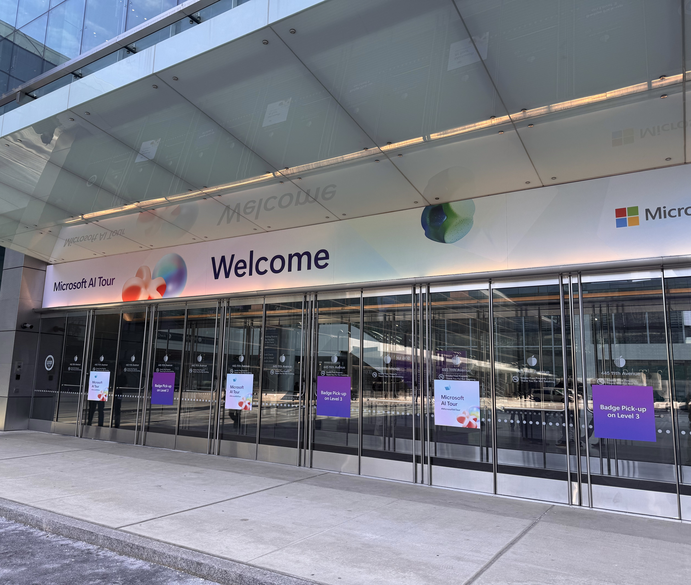

*Reflections on deploying an internal AI solution in a financial institution.*

| Date | Category |
|------|----------|
| 2025-12-11 | Insights / AI |

---

## A Cold Morning at the Javits Center

At the beginning of this year, on a brutally windy NYC winter morning, I walked into the Javits Center to attend the Microsoft AI Tour. I had one question that kept evading me: **How do organizations successfully implement an in-house AI solution that actually gets adopted?**

Most of the keynote presentations felt like YouTube ads we rush to skip. But one breakout session stuck with me—a panel with representatives from Nasdaq and Morgan Stanley discussing secure AI in finance. Their biggest takeaway? **Culture matters.** Executives have to believe in what they're building and champion it the whole way. The moment that support wavers, the project starts to die. Developers and engineers can only go so far by themselves. 

That conversation stayed with me. Not because it was revolutionary, but because I saw it firsthand over the next twelve months.

---

## The Problem: Information Overload

Our financial institution had a frustrating problem. When members called in with questions—about loan policies, account procedures, compliance requirements—our frontline staff often knew the answer existed *somewhere* in the knowledge base. But finding it quickly? That was the challenge.

Picture this: a member's on hold, a frontline employee is flipping through PDFs and SharePoint folders, and the clock is ticking. The answer exists. It's in there. But *where?*

It wasn't just a technical problem—it was a member experience problem. The longer employees spent hunting, the longer members waited. The frustration bubbled up from both sides.

**The use case was clear:** build an internal RAG-based AI assistant that could surface answers from our knowledge base instantly. Ask a question, get an answer—grounded in our own documentation.

---

## Building AI in a Financial Institution

Here's where context adds complexity. We're a financial institution. Security, compliance, and guardrails aren't nice-to-haves—they're table stakes.

Every component had to be locked down. Public exposure wasn't even on the table. From an infrastructure perspective, this meant:

- **Private endpoints everywhere.** The AI solution is only accessible through our hybrid network—no exceptions.
- **Microsoft Foundry** for our LLM endpoints (which was named Azure AI Foundry when the project started—imagine explaining *that* name change in meetings for a month).
- **Secure networking:** Site-to-site VPN, firewall rules, strict access controls.
- **Scalable architecture:** Azure Kubernetes Service, App Services, PostgreSQL, and Cosmos DB—configured to scale with demand.
- **Performance tuning:** Latency matters when frontline members are on live calls. We spent real time shaving seconds off response times.

Building in a regulated industry means every architectural decision gets scrutinized. But that rigor also means when you ship, you ship with confidence.

---

## Lessons Learned

### 1. Executive Buy-In is Everything

The executive leading our project kept it on track—weekly check-ins, continued advocacy to leadership, and clear deadlines. This wasn't a side project that could drift. When priorities shifted elsewhere in the organization, she pulled it back. When we needed resources, she fought for them.

**Takeaway:** If your executive sponsor isn't all-in, the project will stall. Find someone who won't let it die.

### 2. Start with a Strong Use Case

Every good AI project starts with a real problem. The use case came from departments telling us their biggest bottleneck: finding the right information at the right time. Centralizing our knowledge base and making it searchable was the win.

For Phase 1, we focused on member-facing and banking documentation. Future phases will expand to other departments—IT policies, legal retention requirements, HR procedures. Starting focused let us prove value before scaling. 

**Takeaway:** Don't boil the ocean. Solve one problem well, then expand.

### 3. Work Closely with End Users

During UAT, we held weekly meetings with our "change champions"—the frontline employees who'd actually use the tool. They surfaced issues we wouldn't have caught: latency concerns, occasional hallucinations, wrong documents being retrieved.

One early session, a tester asked a straightforward question and the model confidently cited a policy that didn't exist. The room went quiet. That moment pushed us to tighten our retrieval logic and add source verification. We couldn't have caught that in a vacuum.

**Takeaway:** Your end users are your best QA team. Involve them early—and actually listen.

### 4. Expect Roadblocks

Roadblocks are inevitable. Ours included:

- **Azure quota issues:** We hit limits on which regions could host our App Services and LLM endpoints. This required escalation to Microsoft—and added weeks to our timeline.
- **Model tuning:** Reducing hallucinations and ensuring document relevance took iteration.
- **Latency:** Initial response times were too slow for live calls. Infrastructure and model tuning fixed it, but it wasn't quick.

**Takeaway:** Build buffer time into your timeline. Something will go sideways.

---

## Where We Are Now

The app went into production last month. By the end of the year, **20% of employees, mostly frontline members, have adopted the tool.**

For a first-generation AI solution in a financial institution, that's a solid start. The foundation is set—secure infrastructure, proven adoption, and organizational buy-in to keep going.

If you're navigating something similar, the [Cloud Adoption Framework for AI](https://learn.microsoft.com/en-us/azure/cloud-adoption-framework/scenarios/ai/) has solid guidance on establishing the culture and strategy to see it through.

---

## Final Thoughts

If you're starting an internal AI initiative:

1. **Find an executive who believes in it and won't let it die.**
2. **Start with a use case that solves a real problem.**
3. **Work with your end users—they'll make or break adoption.**
4. **Expect roadblocks. They're part of the deal.**
5. **In regulated industries, security isn't optional.**

Walking out of the Javits Center in January, I had questions. Walking into next year, I have answers and the mud to show the dirt road driven to get here.

---

[← Back to Insights](../)
