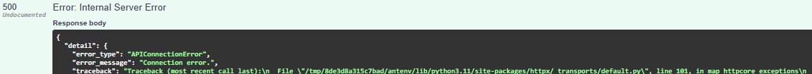
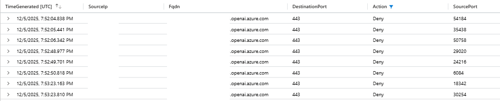
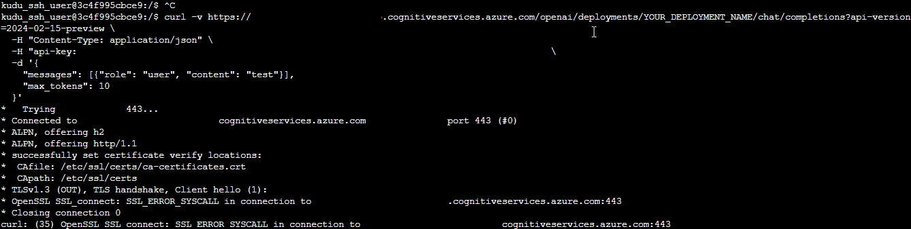
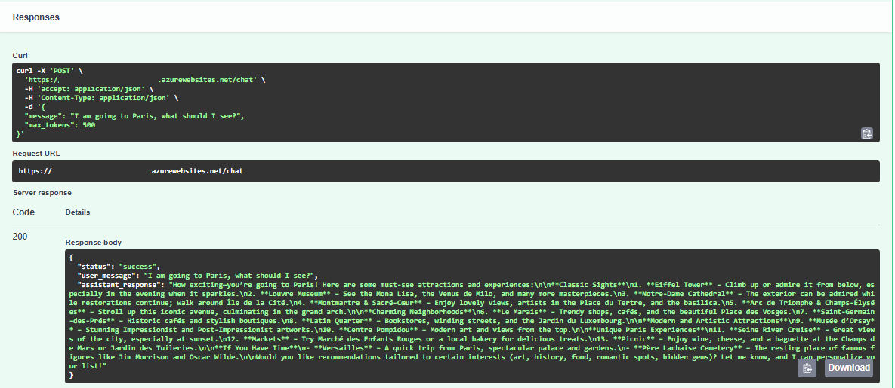
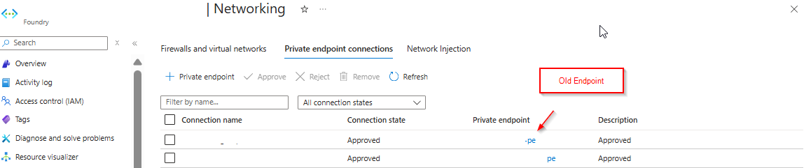
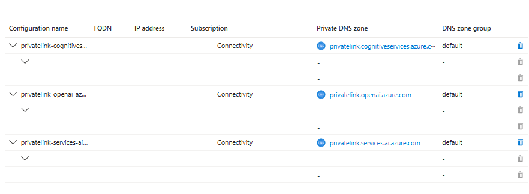

*Troubleshooting APIConnectionError, SSL handshake errors, and private endpoint routing issues when connecting to Microsoft Foundry (formerly Azure AI Foundry) via private endpoints.*

| Date | Category |
|------|----------|
| 2025-12-26 | Insights / Azure |

---

## 📋 Overview

**Is this article for you?** If you're experiencing intermittent connection failures between an Azure resource (Web App, VM, Container, etc.) and Azure OpenAI (Microsoft Foundry) behind a private endpoint, this might help.

**Note:** While this article focuses on Azure OpenAI, the troubleshooting approach and lessons learned apply to **any Azure resource communicating with another resource via private endpoint**—whether it's Storage, SQL Database, Key Vault, or any other service.

**Environment:**
- Azure Web App (or any Azure resource) connecting to Azure OpenAI / Microsoft Foundry
- Private endpoints enabled (no public access)
- Traffic routed through Azure Firewall or vWAN
- VNet integration configured

**Symptoms:**
- Random, intermittent connection failures (works sometimes, fails other times)
- Production environment works fine, but Dev/Test fails
- No clear pattern to the failures

**Errors you might be seeing:**
```
❌ openai.APIConnectionError: Connection error.
❌ httpcore.ConnectError: EOF occurred in violation of protocol (_ssl.c:1016)
❌ OpenSSL SSL_connect: SSL_ERROR_SYSCALL
❌ curl: (35) OpenSSL SSL_connect: SSL_ERROR_SYSCALL
```

**💡 Spoiler:** The issue was network topology—my private endpoint was in a different region/VNet than my Web App, causing traffic to traverse unnecessary hops and become unstable.

---

## ⚡ If I Had to Do This Again

Before you spend hours digging through logs, start here:

1. **Map the network path first.** Where is your Web App? Where is your private endpoint? Are they in the same VNet? Same region?

2. **Check private endpoint placement.** If your consuming resource and private endpoint are in different VNets or regions, you're adding unnecessary hops—and potential failure points.

3. **Ask: Why is traffic taking this path?** If traffic is traversing a firewall or crossing regions, that might be the problem—not the firewall rules themselves.

4. **Co-locate your resources.** Private endpoints should live in the same network as the resources consuming them.

**✅ The fix for my issue:** Moving the private endpoint to the same VNet as the Web App. That's it. No firewall rule changes. No code changes. Just network topology.

---

## 🔴 The Error That Started It All

It started with a cryptic error in our Dev environment:



```json
{
  "error_type": "APIConnectionError",
  "error_message": "Connection error."
}
```

Digging deeper into the stack trace revealed:

```
httpcore.ConnectError: EOF occurred in violation of protocol (_ssl.c:1016)
openai.APIConnectionError: Connection error.
```

The Dev Web App was randomly failing to reach our Azure OpenAI (Microsoft Foundry) endpoint. Not every time—just often enough to be infuriating. One call would succeed. The next would drop. No pattern. No predictability.

Production? Working fine. Same code. Same configuration. Different results.

---

## 🏗️ The Setup

To understand the issue, here's what we were working with:

- **Azure Web App** (Python) in our West US region
- **Azure OpenAI endpoint** (Microsoft Foundry) behind a private endpoint
- **Private networking** with traffic routed through Azure Firewall
- **VNet integration** for the Web App to communicate over private networks

This is a secure, enterprise-grade setup. No public exposure. Everything locked down. Which made the random failures even more puzzling.

---

## 🔍 The Troubleshooting Journey

### Step 1: Reproduce the Issue

I set up a minimal test using the [OpenAI Python SDK](https://github.com/openai/openai-python)—just a basic chat completion call to the Azure OpenAI endpoint from the Web App. No application code. No dependencies. Just a pure connectivity test to isolate the network path.

The error appeared within minutes. At least it was reproducible—intermittent success followed by random failures.

**Initial troubleshooting theories I explored:**

Before diving into logs, I had several theories about what might be wrong:
- VNet integration misconfiguration on the Web App
- Missing RBAC roles (like Cognitive Services Contributor)
- Private endpoint configuration issues

I temporarily enabled public access to the Foundry resource to see if the private endpoint was the culprit—the issue persisted, which was puzzling. I also checked effective routes in the vWAN hub, verified the Web App's VNet integration settings, and even tested creating a Service Connector (though this shouldn't be needed since private endpoints take precedence over service endpoints).

None of these initial theories led anywhere.

### Step 2: Check the Firewall

Since all traffic routes through our Azure Firewall, I started there. If something's being blocked, the firewall knows.

I ran a KQL query against the firewall logs:

```kql
let searchTerm = "<your-openai-resource>.openai.azure.com";
AZFWNetworkRule
| union AZFWApplicationRule
| where Fqdn contains searchTerm or TargetUrl contains searchTerm
| project
    TimeGenerated,
    SourceIp,
    DestinationIp,
    DestinationPort,
    Action,
    Rule,
    ActionReason,
    Fqdn,
    Protocol
| order by TimeGenerated desc
```



Sure enough—intermittent denies. The traffic was getting blocked, but not consistently. The denies started appearing around the same time our issues began.

But *why* was it being denied? The firewall rules looked correct.

### Step 3: Test from the Web App Directly

I SSH'd into the Web App via the Kudu console (SCM) and ran some direct tests:

```bash
nslookup <your-openai-resource>.cognitiveservices.azure.com
```

DNS resolved correctly to the private endpoint IP. Good.

```bash
curl -v https://<your-openai-resource>.cognitiveservices.azure.com
```

And then:



```
OpenSSL SSL_connect: SSL_ERROR_SYSCALL in connection to <endpoint>:443
curl: (35) OpenSSL SSL_connect: SSL_ERROR_SYSCALL
```

An SSL handshake failure. Intermittently. This pointed to something deeper—network path instability, not a configuration issue.

The frustrating part? It randomly worked too:



### Step 4: The Moment of Clarity

I stepped back and looked at the network topology. Where was the private endpoint actually located?

**The Dev OpenAI private endpoint was in our East US vWAN Hub.**

**The Dev Web App was in West US.**

Every request from the Web App had to:
1. Leave the Web App VNet
2. Traverse VNet peering to the Hub
3. Pass through the Azure Firewall
4. Cross regions to reach the private endpoint

Multiple hops. Cross-region latency. Firewall processing. No wonder the connections were unstable.

**Production didn't have this problem** because the Production OpenAI private endpoint was already co-located in the same region and VNet as the Production Web App. Direct path. Minimal hops. Stable connections.

---

## ✅ The Fix

The solution was straightforward once I understood the root cause:

**1. Created a new private endpoint** for the Dev Microsoft Foundry resource in the same Virtual Network as the Dev Web App vNet Integration subnet:



**2. Updated the Private DNS Zone** records to point to the new private endpoint:



After the change, traffic no longer traversed the firewall or crossed regions. Traffic flowed directly within the same network zone, and the intermittent failures stopped immediately.

---

## 🧭 Understanding Private Endpoint Routing

After implementing the fix, you might notice something interesting: **the traffic no longer appears in your firewall logs.** This isn't a monitoring issue—it's how Azure routes private endpoint traffic.

> **📘 Microsoft Guidance on Private Endpoint Traffic Inspection:**  
> According to [Microsoft's official documentation](https://learn.microsoft.com/en-us/azure/private-link/inspect-traffic-with-azure-firewall), **application rules are preferred over network rules** when inspecting private endpoint traffic. Application rules automatically handle SNAT, maintaining flow symmetry. If you use network rules or a third-party NVA, you **must configure SNAT** to preserve return traffic routing. The recommended architecture is a **dedicated VNet for private endpoints** (Scenario 1 in Microsoft's hub-and-spoke design), which minimizes routing complexity and avoids the 400-route limit.

### Same VNet: Direct Routing (No Firewall)

When your Web App and private endpoint are in the **same VNet**, Azure creates a highly specific `/32` route for the private endpoint's IP address. This route takes precedence over any User-Defined Routes (UDRs) you've configured—including routes that send traffic to your firewall.

**What this means:**
- Traffic goes **directly** from the Web App to the private endpoint
- **No firewall traversal** (even if you have UDRs configured)
- **Lower latency** and more stable connections
- **No firewall logs** for this traffic

This is Azure's default behavior and is actually a **best practice** for most scenarios. Private endpoint traffic is already encrypted and stays on the Azure backbone—it doesn't need additional firewall inspection in most cases.

### Different VNets: Firewall Routing

When your Web App and private endpoint are in **different VNets** (like my original setup), the `/32` route doesn't apply. Traffic follows your configured UDRs, which typically route through a firewall in a hub-and-spoke topology.

**What this means:**
- Traffic traverses **VNet peering** to reach the other VNet
- Traffic goes **through your firewall** (if UDRs are configured)
- **Higher latency** due to additional hops
- **Potential instability** (especially cross-region)
- **Firewall logs** show the traffic

### What If You Need Firewall Inspection?

If your security requirements mandate that **all** traffic—including same-VNet private endpoint traffic—must be inspected by a firewall, you need to:

1. **Enable network policies** on the subnet hosting the private endpoint
2. **Create a UDR** with a prefix equal to or more specific than the VNet address space
3. **Configure SNAT** on your firewall to maintain flow symmetry

**Example:**
```bash
# Enable network policies on the private endpoint subnet
az network vnet subnet update \
  --name <pe-subnet> \
  --vnet-name <vnet-name> \
  --resource-group <rg> \
  --disable-private-endpoint-network-policies false

# Create UDR to force traffic through firewall
az network route-table route create \
  --route-table-name <route-table> \
  --name ForceFirewall \
  --address-prefix 10.0.0.0/16 \  # Must match or be more specific than VNet
  --next-hop-type VirtualAppliance \
  --next-hop-ip-address <firewall-ip>
```

**Important:** A default route (`0.0.0.0/0`) will **not** override the `/32` private endpoint route. Your UDR must be as specific as or more specific than the VNet's address space.

### 💡 My Recommendation

For most scenarios, **let private endpoint traffic route directly** (same VNet, no firewall). The traffic is:
- Already encrypted (TLS)
- Stays on the Azure backbone (never touches public internet)
- More reliable with fewer hops

Only force firewall inspection if you have specific compliance requirements that mandate it.

---

## 🤔 What I Missed

Looking back, the clue was there from the beginning: **Why was Dev traffic traversing the firewall at all?**

I got tunnel vision on the firewall logs and the SSL errors. I assumed the network path was correct and focused on *what* was failing instead of *where* it was failing.

If I had traced the network path first—looked at the effective routes, checked the private endpoint locations—I would have found the answer in minutes, not days.

---

## 📝 Lessons Learned

1. **Private endpoint placement matters.** Co-locate private endpoints with consuming resources to minimize network hops.

2. **Cross-region private endpoint access is fragile.** VNet peering and firewall traversal add latency and failure points.

3. **Don't just look at the error—trace the path.** Network issues require understanding the full journey, not just the destination.

4. **Production working doesn't mean Dev is configured the same.** Environment parity matters, especially for network topology.

5. **SSL errors can mask routing issues.** A failing SSL handshake might mean the packets aren't arriving reliably in the first place.

---

## 🎯 Key Takeaways

| Symptom | Misleading Assumption | Actual Root Cause |
|---------|----------------------|-------------------|
| `APIConnectionError` | Application code issue | Network routing problem |
| Intermittent failures | Load or rate limiting | Unstable network path |
| SSL handshake errors | Certificate or TLS config | Packet drops from long network path |
| Firewall denies | Firewall rules wrong | Traffic shouldn't traverse firewall |

---

## 💭 Final Thoughts

Networking issues are humbling. The error message says "connection error" but the fix is "move your private endpoint to the correct VNet."

Next time you're debugging intermittent connectivity to a private endpoint, start with the network topology. Ask yourself: *Why is traffic taking this path?* The answer might save you days of digging through logs.

---

## 📚 Resources

- [Azure Private Endpoint Overview](https://learn.microsoft.com/en-us/azure/private-link/private-endpoint-overview)
- [Private Link in Hub-Spoke Networks](https://learn.microsoft.com/en-us/azure/architecture/guide/networking/private-link-hub-spoke-network)
- [Troubleshoot Azure Private Endpoint Connectivity](https://learn.microsoft.com/en-us/azure/private-link/troubleshoot-private-endpoint-connectivity)

---

[← Back to Insights](../)
